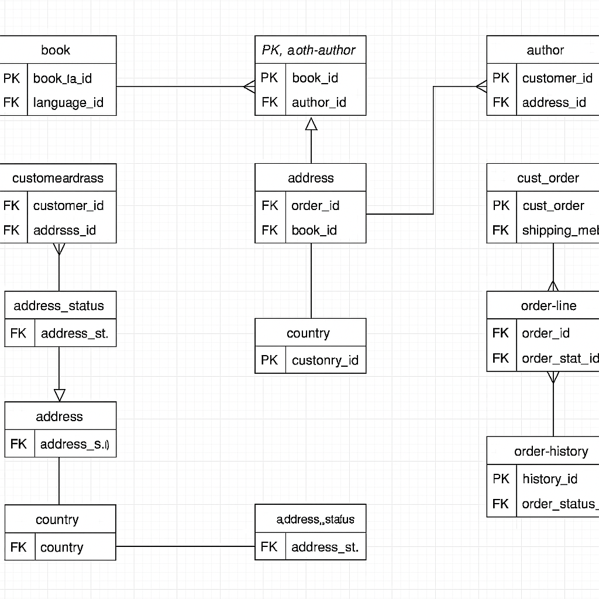

# Bookstore Management System

The **Bookstore Management System** is a personal learning project developed to explore and understand how relational databases work in a real-world application. The system is designed to simulate how a bookstore might manage its inventory, authors, customers, and orders. This hands-on project allowed us to put into practice core concepts in database design, SQL scripting, and MySQL management.

---

## Objective

The goal of this project was to help us develop practical knowledge in:

- Structuring tables for efficient data storage and management.
- Creating relationships between key entities like books, customers, and orders.
- Normalizing data to improve consistency and reduce redundancy.
- Writing SQL queries to handle operations such as adding new books, retrieving customer orders, and managing stock levels.

Through this project, we've gained foundational experience in designing and interacting with a relational database system using MySQL.

---

## ERD

📌 *The Entity-Relationship Diagram (ERD) visually represents the structure and relationships between the tables in the database.*  

---

## Contributors

- Nesta Karuri
- Stacy Kamau
- John Njoroge

---

